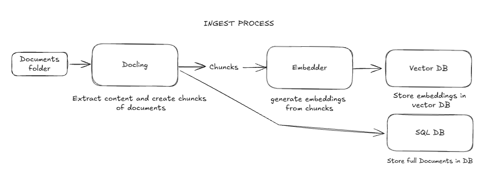
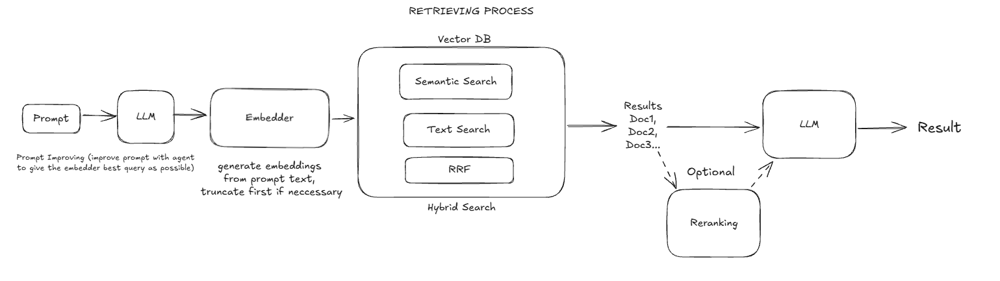

# 🧠 Hybrid RAG

A customizable **Hybrid Retrieval-Augmented Generation** system. It combines **semantic** and **keyword-based search** with optional **reranking** for high-quality knowledge retrieval, available through both a **CLI** and a **REST API**. Multiformat ingestion is supported.

---

## ✨ Features

- **Hybrid Search** — Combines vector similarity (semantic) and full-text (keyword) search for better retrieval.
- **Reranking** — Optional cross-encoder reranking to improve result relevance.
- **Streaming Responses** — Real-time streamed LLM responses in CLI mode.
- **Session Persistence** — Conversation history stored in Supabase for multi-turn interactions.
- **Multiformat Ingestion** — Multi-Format Ingestion: PDF, Word, PowerPoint, Excel, HTML, Markdown, Audio transcription.
- **REST API** — FastAPI endpoints for health check, running queries, and live configuration.
- **Flexible LLM Support** — Use cloud models (Gemini, OpenAI) or local models via Ollama.
- **Evaluation Suite** — Built-in RAG evaluation via [RAGAS](https://docs.ragas.io/).

---

## 📐 Architecture Diagrams

### Ingest Process

> The ingestion pipeline takes raw documents, chunks them, generates embeddings, and stores everything in Supabase.



### Retrieving Process

> The retrieval pipeline receives a user query, performs hybrid search (semantic + keyword) with optional reranking, and feeds the context to the LLM agent.



---

## 📁 Project Structure

```
hubryd-rag/
├── main.py                  # Entry point — CLI or API mode
├── cli.py                   # Interactive CLI with streaming
├── settings.py              # Centralized configuration (env + defaults)
├── setup.py                 # Terminal-based setup wizard
├── requirements.txt         # Python dependencies
│
├── rag_agent/               # Agent core
│   ├── agent.py             # RagAgent class (LLM + tools + session)
│   ├── agent_tools.py       # Search tool (hybrid search function)
│   ├── reranker.py          # Cross-encoder reranking
│   ├── supabase_session.py  # Conversation persistence in Supabase
│   └── system_prompt.py     # System prompt for the agent
│
├── ingestion/               # Document ingestion pipeline
│   ├── main.py              # Ingestion CLI entry point
│   ├── ingest.py            # DocumentIngestionPipeline class
│   ├── chuncker.py          # Document chunking logic
│   ├── embedder.py          # Embedding generation (OpenAI-compatible)
│   └── gdrive.py            # Google Drive file download
│
├── api/                     # REST API (FastAPI)
│   ├── app.py               # App factory
│   ├── routes.py            # /api/alive, /api/run, /api/config
│   └── models.py            # Request/response Pydantic models
│
├── models/                  # Shared data models
│   ├── chuncker.py          # Chunk model
│   └── ingest.py            # Ingestion config/result models
│
├── tests/                   # Tests
│   ├── test_ingestion.py
│   ├── test_hybrid_search.py
│   └── verify_embedder.py
│
└── documents/               # Default document folder for ingestion
```

---

## 🚀 Quick Start

### 1. Create a Supabase project

Go to [supabase.com/dashboard](https://supabase.com/dashboard) and create a new project. Save the **API key** and **URL** from the project settings.

### 2. Clone and set up the environment

```bash
git clone <repo-url>
cd hubryd-rag

python3 -m venv .venv

# Linux / macOS
source .venv/bin/activate

# Windows
.venv\Scripts\activate
```

### 3. Run the setup wizard

```bash
python3 setup.py
```

The wizard will:

- Install dependencies from `requirements.txt`
- Optionally install [RAGAS](https://docs.ragas.io/) for evaluation
- Guide you through configuration (embeddings, LLM, API keys) and create a `.env` file
- Generate the SQL schema for Supabase

### 4. Initialize Supabase tables

Copy the generated content from `init_supabase.sql` into the **SQL Editor** in Supabase Dashboard and execute it.

> [!TIP]
> More documentation about hybrid search in Supabase:
> [supabase.com/docs/guides/ai/hybrid-search](https://supabase.com/docs/guides/ai/hybrid-search)

---

## 📥 Ingesting Documents

### From local files

```bash
python3 ingestion/main.py --documents ./documents --verbose
```

### From Google Drive

```bash
python3 ingestion/main.py --gdrive --folder-id <FOLDER_ID> --verbose
```

### Ingestion options

| Flag                | Description                                  | Default                |
| ------------------- | -------------------------------------------- | ---------------------- |
| `--documents`, `-d` | Local documents folder path                  | `documents`            |
| `--no-clean`        | Skip cleaning existing data before ingestion | `false`                |
| `--chunk-overlap`   | Overlap size between chunks                  | `200`                  |
| `--max-tokens`      | Max tokens per chunk                         | `512`                  |
| `--gdrive`          | Ingest from Google Drive                     | `false`                |
| `--folder-id`       | Google Drive folder ID                       | env `GDRIVE_FOLDER_ID` |
| `--verbose`, `-v`   | Enable debug logging                         | `false`                |

---

## 💬 Usage

### CLI Mode

```bash
python3 main.py --cli --session my_session
```

Commands inside the CLI:

- `info` — Show system configuration
- `clear` — Clear screen
- `exit` — Quit

### API Mode

```bash
python3 main.py --host 0.0.0.0 --port 8000
```

#### Endpoints

| Method | Endpoint      | Description                                          |
| ------ | ------------- | ---------------------------------------------------- |
| `GET`  | `/api/alive`  | Health check — returns `{"status": "ok"}`            |
| `POST` | `/api/run`    | Send a prompt and receive the agent response         |
| `POST` | `/api/config` | Update runtime configuration (LLM, embeddings, etc.) |

#### `GET /api/alive` — Health check

```bash
curl http://localhost:8000/api/alive
```

Response:

```json
{
  "status": "ok"
}
```

#### `POST /api/run` — Run a query

```bash
curl -X POST http://localhost:8000/api/run \
  -H "Content-Type: application/json" \
  -d '{
    "prompt": "What is hybrid search?",
    "session_id": "default"
  }'
```

Request body:

| Field        | Type   | Required | Description                                                    |
| ------------ | ------ | -------- | -------------------------------------------------------------- |
| `prompt`     | string | ✅       | The user query to send to the agent                            |
| `session_id` | string | ❌       | Session ID for conversation persistence (default: `"default"`) |

Response:

```json
{
  "response": "Hybrid search combines semantic vector search with traditional keyword-based full-text search to improve retrieval quality..."
}
```

#### `POST /api/config` — Update runtime configuration

```bash
curl -X POST http://localhost:8000/api/config \
  -H "Content-Type: application/json" \
  -d '{
    "llm_model": "gpt-4o",
    "rerank_enabled": true,
    "rerank_top_k": 3
  }'
```

Request body (all fields optional — only supplied fields are updated):

| Field                  | Type   | Description                       |
| ---------------------- | ------ | --------------------------------- |
| `llm_model`            | string | LLM model name                    |
| `llm_local`            | bool   | Use local LLM via Ollama          |
| `llm_base_url`         | string | LLM API base URL                  |
| `llm_api_key`          | string | LLM API key                       |
| `embedding_model`      | string | Embedding model name              |
| `embedding_dimensions` | int    | Embedding vector dimensions       |
| `embedding_api_key`    | string | Embedding API key                 |
| `embedding_base_url`   | string | Embedding API base URL            |
| `default_match_count`  | int    | Default number of search results  |
| `max_match_count`      | int    | Maximum number of search results  |
| `supabase_url`         | string | Supabase project URL              |
| `supabase_key`         | string | Supabase API key                  |
| `rerank_enabled`       | bool   | Enable cross-encoder reranking    |
| `rerank_model`         | string | Reranking model name              |
| `rerank_top_k`         | int    | Number of results after reranking |

Response:

```json
{
  "llm_model": "gpt-4o",
  "llm_local": false,
  "llm_base_url": "http://localhost:11434/v1",
  "embedding_model": "snowflake-arctic-embed2",
  "embedding_dimensions": 1024,
  "embedding_base_url": "http://localhost:11434/v1",
  "default_match_count": 10,
  "max_match_count": 50,
  "supabase_url": "https://xxx.supabase.co"
}
```

---

## ⚙️ Configuration

All settings are managed via environment variables (`.env` file). Key options:

| Variable                  | Description                       | Default                                |
| ------------------------- | --------------------------------- | -------------------------------------- |
| `SUPABASE_URL`            | Supabase project URL              | —                                      |
| `SUPABASE_KEY`            | Supabase API key                  | —                                      |
| `EMBEDDING_MODEL`         | Embedding model name              | `snowflake-arctic-embed2`              |
| `EMBEDDING_DIMENSIONS`    | Embedding vector size             | `1024`                                 |
| `EMBEDDING_BASE_URL`      | Embedding API base URL            | `http://localhost:11434/v1`            |
| `LLM_LOCAL`               | Use local LLM via Ollama          | `False`                                |
| `LLM_MODEL`               | LLM model name                    | `gemini-3-flash-preview`               |
| `LLM_BASE_URL`            | LLM API base URL (local)          | `http://localhost:11434/v1`            |
| `LLM_API_KEY`             | LLM API key                       | —                                      |
| `RERANK_ENABLED`          | Enable cross-encoder reranking    | `False`                                |
| `RERANK_MODEL`            | Reranking model                   | `cross-encoder/ms-marco-MiniLM-L-6-v2` |
| `RERANK_TOP_K`            | Number of results after reranking | `5`                                    |
| `TRACING_API_KEY`         | OpenAI tracing API key            | —                                      |
| `GDRIVE_CREDENTIALS_FILE` | Google Drive service account JSON | `credentials.json`                     |
| `GDRIVE_FOLDER_ID`        | Google Drive folder to ingest     | —                                      |

### Supported Embedding Models

| Model                     | Dimensions | Max Tokens |
| ------------------------- | ---------- | ---------- |
| `snowflake-arctic-embed2` | 1024       | 8191       |
| `nomic-embed-text-v2-moe` | 768        | 512        |

## The user can add new embedding models to the `settings.py` file.

## 🧪 Evaluation

The project includes a RAG evaluation suite powered by [RAGAS](https://docs.ragas.io/).

```bash
cd rag_eval
pip install -e .
```

Refer to [rag_eval/README.md](rag_eval/README.md) for evaluation instructions.

---

## 📦 Dependencies

- [supabase-py](https://github.com/supabase/supabase-py) — Supabase client
- [openai](https://github.com/openai/openai-python) — OpenAI API / local LLM client
- [pydantic](https://docs.pydantic.dev/) — Data validation
- [docling](https://github.com/DS4SD/docling) — Document conversion
- [FastAPI](https://fastapi.tiangolo.com/) + [Uvicorn](https://www.uvicorn.org/) — REST API
- [sentence-transformers](https://www.sbert.net/) — Reranking models
- [google-api-python-client](https://github.com/googleapis/google-api-python-client) — Google Drive integration
- [python-dotenv](https://pypi.org/project/python-dotenv/) — Environment variable management

---

## 📄 License

MIT
